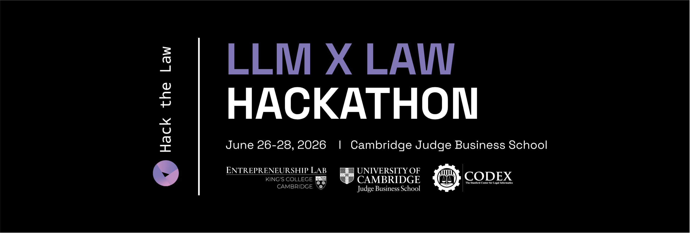

<p align="center">
  
</p>

<h1 align="center">Arbitrage</h1>

<p align="center">
  <b>An AI co-counsel for navigating regulatory regimes across the UK and EU.</b><br>
  One knowledge graph of legislation, delegated instruments, case law and regulator guidance —<br>
  searchable, comparable across jurisdictions, and grounded in the source text.
</p>

---

## 🏆 Winner — Best Use of the EU Publications Office Legal Data API

Built in 48 hours at **[Hack the Law 2026](https://hackthelaw-cambridge.com/hackathon-2026/)**, Cambridge Judge Business School. 50+ teams competed and most of them built on the EU Publications Office's CELLAR data — we won the prize for the best use of it. The winners' card is on the [hackathon site](https://hackthelaw-cambridge.com/hackathon-2026/).

### One-minute demo

[](https://youtu.be/89IYVZtUXxI)

---

## The problem

Answering "how does the UK's Online Safety Act differ from the EU's Digital Services Act, and what does that mean for my client?" is not a search problem. The answer lives across a **regime** — an Act, the statutory instruments made under it, the regulator's codes and guidance, the case law interpreting it, and the parliamentary debate behind it — and those documents don't sit in one place, don't share an identifier scheme, and don't agree on what outranks what.

General-purpose chatbots handle this badly: they flatten a hierarchy of legal authority into undifferentiated prose, and they invent citations.

## What Arbitrage does

1. **Pick a jurisdiction and a topic.** UK, EU, or both.
2. **Arbitrage surfaces the candidate regimes** — anchor Acts plus everything hanging off them — and you confirm which ones are in scope.
3. **It builds a dossier per regime**: scope, how it's enforced, penalties, and a list of concrete obligations, each carrying a real reference and a link to the official text.
4. **You ask questions in natural language.** Answers are hard-scoped to the confirmed regimes and drawn only from the retrieved subgraph, with citations back to legislation.gov.uk / EUR-Lex.
5. **Because UK and EU material lives in the same graph**, side-by-side comparison across jurisdictions falls out of the model rather than needing a separate feature.

The grounding is structural rather than a prompt instruction: the model is only ever handed provisions that a deterministic Cypher query actually returned, and every reference it emits has to be one of them.

---

## How it works

```
  legislation.gov.uk ┐
  UK Parliament APIs │
  Find Case Law      ├─► [ ADAPTER ] ─► Canonical JSON ─► [ LOAD ] ─► Neo4j ─► [ RETRIEVAL ] ─► [ CLAUDE ] ─► UI
  GOV.UK guidance    │   per-source      shared schema     [ LINK ]   graph    Graph RAG +      grounded
  EU CELLAR / EUR-Lex┘                                                         PageIndex        synthesis
```

Everything downstream of the canonical format is written once and reused. Only the adapters know which jurisdiction a document came from.

### 1. Ingestion — many sources, one shape

Nine adapters ([`src/legalgraph/adapters/`](src/legalgraph/adapters/)) each fetch from a different official source and emit the same [`Document`](src/legalgraph/canonical.py) model:

| Source | What it yields |
| --- | --- |
| legislation.gov.uk + CLML | UK Acts and statutory instruments, full section tree |
| UK Parliament Bills & Hansard APIs | Bills, debates (travaux préparatoires) |
| Find Case Law | UK judgments |
| GOV.UK | Government guidance |
| Regulator PDFs (OCR'd) | Ofcom / ICO codes and policy documents |
| **EU Publications Office — CELLAR** | EU Regulations, Directives, CJEU judgments and AG opinions — the SPARQL endpoint for the authority metadata, the English XHTML manifestation for the document body |

Loading is two passes — `load` writes nodes, `link` writes edges — so a citation pointing at a document you haven't ingested yet never breaks the load. Unresolved targets are reported instead, which doubles as a "what's missing from the corpus" report. Every stage is idempotent and disk-backed, so a run that dies halfway resumes rather than restarts.

### 2. The graph model — hierarchy is first-class

Two orthogonal structures, kept separate but linked:

- **Between documents** — the authority/citation graph: `MADE_UNDER`, `ISSUED_UNDER`, `CONSIDERS`, `EXPLAINS`, `DEBATED_IN`, `BECAME`.
- **Within a document** — the `Provision` tree (Part → Chapter → Section → Subsection), which doubles as the PageIndex tree for intra-document retrieval. One structure, so the graph and the document index can't drift apart.

#### Node types, ranked by authority

Every document is typed into one of ten layers and carries a `precedence` score, so retrieval knows a regulator's guidance note doesn't outrank the Act it was issued under:

| Layer | What it is | Precedence |
| --- | --- | ---: |
| `Treaty` | EU primary law (TEU/TFEU/Charter); constitutions | 100 |
| `Act` | Primary legislation — UK Acts, EU Regulations and Directives | 90 |
| `StatutoryInstrument` | Delegated, ministerial — UK SIs | 80 |
| `RegulatoryInstrument` | Delegated, regulator-made and **binding** — FCA Handbook, RTS/ITS | 70 |
| `Case` | Judgments, **+ a court-hierarchy bump** — UKSC/CJEU +9, EWCA +6, EWHC +4, UKFTT +1 | 60+ |
| `HansardDebate` | Debates — travaux préparatoires, for purposive reading | 30 |
| `ExplanatoryNote` | Interpretive aid | 20 |
| `RegulatoryPolicy` | Regulator policy/procedure, usually non-binding | 15 |
| `Guidance` | Soft law | 10 |
| `Bill` | Not yet law | 0 |

Under each document hangs its `Provision` tree, and provisions carry their own `legal_force` (`operative` / `binding_rule` / `evidential` / `guidance`) — because one document can mix binding and non-binding text, the FCA Handbook's R/E/G markers being the obvious case. `Concept` nodes sit outside the hierarchy entirely, as the shared subject vocabulary.

#### Relationship types

| Edge | Direction | Meaning |
| --- | --- | --- |
| `CONTAINS` | Document → Provision → Provision | Structural: the section tree |
| `MADE_UNDER` | SI / RegulatoryInstrument → enabling Act provision | Which power an instrument was made under |
| `ISSUED_UNDER` | Guidance / RegulatoryPolicy → Act or provision | Ofcom's codes hanging off the OSA |
| `CONSIDERS`, `INTERPRETS`, `APPLIES` | Case → Provision | Case law bearing on a specific section |
| `CITES`, `FOLLOWS`, `DISTINGUISHES`, `OVERRULES` | Case → Case | The precedent web |
| `AMENDS`, `REPEALS`, `INSERTS`, `SUBSTITUTES` | Provision → Provision | Textual amendment, carrying `valid_from` / `valid_to` |
| `BECAME` | Bill → Act | Legislative lineage |
| `DEBATED_IN` | Bill / Act → HansardDebate | Where it was argued out |
| `EXPLAINS` | ExplanatoryNote → Act or provision | Interpretive aid |
| `TRANSPOSES`, `IMPLEMENTS` | National measure → EU instrument | The cross-jurisdiction bridge |
| `ABOUT` | Document → Concept | Subject tagging |
| `BROADER`, `NARROWER`, `RELATED` | Concept → Concept | SKOS thesaurus structure |

So a regime, walked outward from its anchor Act, looks like this:

```
                                Bill
                                  │ BECAME
                                  ▼
  HansardDebate ◄──DEBATED_IN──  ACT  ──ABOUT──►  Concept ──RELATED──►  Concept
                                ▲ ▲ ▲                                      ▲
      StatutoryInstrument ──────┘ │ └────── ExplanatoryNote                │ ABOUT
             MADE_UNDER           │            EXPLAINS                    │
                                  │                                 EU Regulation
       Ofcom code ──ISSUED_UNDER──┤
                                  │                            same concept, so UK
       Case ──CONSIDERS───────────┘                            and EU regimes align
         │ CITES                                               with no extra mapping
         ▼
       Case
```

The full vocabulary is in [`canonical.py`](src/legalgraph/canonical.py); the weekend's corpus populates `CITES`, `MADE_UNDER`, `DEBATED_IN`, `CONSIDERS`, `ISSUED_UNDER`, `AMENDS`, `EXPLAINS` and `BECAME`.

**Regimes** are made relatable through `Concept` nodes — a controlled thesaurus with SKOS `BROADER`/`NARROWER`/`RELATED` edges. Three independent signals combine to link one regime to another: shared subject concepts, the *same* concept tagged on both a UK and an EU document (this is what makes cross-jurisdiction comparison work), and a shared regulator.

### 3. Retrieval — deterministic first, LLM second

[`retrieval.py`](src/legalgraph/retrieval.py) is two-stage and contains no LLM calls at all:

- **Stage 1 (Graph RAG)** — full-text and concept entry points into the graph, then expansion out to the surrounding authorities: the parent Act, the SIs made under it, the guidance issued under it, the cases considering it, and neighbouring regimes.
- **Stage 2 (PageIndex)** — each matched provision's breadcrumb of ancestors, so the UI can show *where in the Act* a hit sits and let you drill down level by level.

When a chat question comes in, a scope clause hard-restricts matches to the user's confirmed regimes: either the provision's own document is an anchor, or it hangs off one via a non-structural edge.

### 4. Synthesis — Claude, on a short leash

[`llm.py`](src/legalgraph/llm.py) is the only place the app talks to Anthropic, and it does three jobs, all with structured outputs:

- **Dossier drafting** — given a regime's subgraph, produce summary / scope / process / consequence / obligations, with every reference required to come from the supplied material.
- **Chat answers** — grounded in the scoped provisions and related documents, plus 2–3 suggested follow-up questions phrased in the user's own voice.
- **Live regulatory guidance** — the one place we *want* the model to leave the graph: a web-search tool call that finds the regulator's currently published codes and guidance on official domains, cached per regime with a timestamp so the UI can show how fresh it is.

### 5. Agentic ingestion — add a regime by asking

The corpus shouldn't be fixed at whatever we managed to ingest on the Saturday. [`agent.py`](src/legalgraph/agent.py) runs a Claude Agent SDK loop that takes a natural-language request ("add the EU AI Act"), resolves the stable identifier (UK legislation id or EU CELEX number) by searching rather than guessing, runs the existing pipeline in `--plan` mode, then commits to Neo4j and verifies the result with Cypher. Writes go through a single gate (`is_write_command`) — the CLI asks for confirmation at the terminal, the web endpoint treats submitting the prompt as the authorisation.

It's exposed both as a CLI ([`scripts/add_act.py`](scripts/add_act.py)) and as the "Add a regime" modal in the UI, via `POST /regimes/add`.

### 6. The interface

A TanStack Start + React frontend ([`RegExplorerSite/`](RegExplorerSite/), scaffolded with Lovable then hand-worked): a setup screen for jurisdiction + topic, a workspace with chat on one side and confirmable regime cards on the other, expandable dossiers with editable fields, and a regimes browser. Dossier text renders reference markers as hoverable links back to the underlying provision.

---

## What's in the demo corpus

Anchored on the Online Safety Act 2023 and its neighbours, bounded by [`config/scope.yaml`](config/scope.yaml) — seed documents plus a hop count, so the corpus scales by config rather than code.

| | |
| --- | --- |
| Documents | **236** — 195 UK, 41 EU |
| Provisions | **~44,000** |
| Breakdown | 87 statutory instruments · 49 Hansard debates · 45 cases · 33 guidance documents · 12 Acts · 5 bills · 5 explanatory notes |
| Regimes with dossiers | Online Safety Act, Communications Act, Data Protection Act, Digital Economy Act, Investigatory Powers Act, GDPR, DSA, DMA, AI Act, e-Commerce Directive, AVMSD |

The graph was hosted on Neo4j Aura over the weekend so the whole team could explore it live in Neo4j Browser — [`demo_queries.cypher`](demo_queries.cypher) has the walkthrough queries.

---

## Repo map

| Path | What's there |
| --- | --- |
| [`src/legalgraph/canonical.py`](src/legalgraph/canonical.py) | The jurisdiction-agnostic document model — the contract between adapters and everything else |
| [`src/legalgraph/adapters/`](src/legalgraph/adapters/) | Per-source fetch + parse (`uk/`, `eu/cellar.py`) |
| [`src/legalgraph/loader.py`](src/legalgraph/loader.py), [`linker.py`](src/legalgraph/linker.py) | The two Neo4j write passes |
| [`src/legalgraph/retrieval.py`](src/legalgraph/retrieval.py) | Graph RAG + PageIndex, pure Cypher |
| [`src/legalgraph/regimes.py`](src/legalgraph/regimes.py), [`dossier.py`](src/legalgraph/dossier.py) | Regime surfacing; dossier build and cache |
| [`src/legalgraph/llm.py`](src/legalgraph/llm.py), [`agent.py`](src/legalgraph/agent.py) | Claude synthesis; the ingestion agent |
| [`src/legalgraph/api.py`](src/legalgraph/api.py) | FastAPI surface — documented in [API.md](API.md) |
| [`RegExplorerSite/`](RegExplorerSite/) | The frontend |
| [`config/scope.yaml`](config/scope.yaml) | What gets ingested |
| [`tests/`](tests/) | pytest suite over the pipeline, retrieval and API |

## Running it

```bash
uv sync
# NEO4J_URI / NEO4J_USERNAME / NEO4J_PASSWORD / NEO4J_DATABASE / ANTHROPIC_API_KEY in .env

uv run legalgraph skeleton                      # constraints + full-text indexes
uv run legalgraph fetch --jurisdiction uk       # adapters -> canonical JSON
uv run legalgraph load && uv run legalgraph link
uv run legalgraph validate --citation "Online Safety Act 2023"

uv run legalgraph serve                         # API on :8000
```

```bash
cd RegExplorerSite && bun install && bun run dev   # UI on :3000, VITE_API_BASE -> the API
```

Adding a single act, either way:

```bash
uv run legalgraph ingest --jurisdiction eu --id 32024R1689 --commit --title "EU AI Act"
uv run python scripts/add_act.py "add the EU AI Act"    # same thing, via the agent
```

## Built with

**EU Publications Office CELLAR** (SPARQL + EUR-Lex manifestations) · **legislation.gov.uk**, **UK Parliament** and **Find Case Law** APIs · **Neo4j** (Aura) · **Anthropic Claude** — Opus for synthesis, the Claude Agent SDK for ingestion · **FastAPI** · **TanStack Start / React / Tailwind**, scaffolded with **Lovable** · written with **Claude Code**.

## Team

- **Keiko Hisana Azka** — tech
- **Eshaan Sikdar** — tech
- **Brandon Wooding** — tech
- **Emily Tang** — law

## Caveats

This was built over a hackathon weekend, and it shows in the places you'd expect. The commit history is coarse and the commit messages are not what they'd be in a repo built at a normal pace — the code was moving faster than the log. The Python package is still named `legalgraph` internally (the product name came later), and the in-app assistant persona is called DORA in the prompts. The corpus is deliberately bounded by `config/scope.yaml` rather than exhaustive, and the API's CORS is wide open for local development.

The point of this repo is to show how the thing works, not to be a turnkey deployment.
